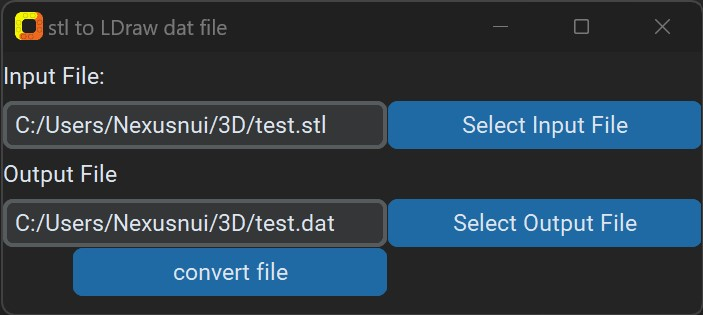

This is a simple graphical Python programm for converting a 3D printing [.stl](https://en.wikipedia.org/wiki/STL_%28file_format%29)
files to LDraw format [.dat](http://www.ldraw.org/article/218) files. Then you can use the part just like any other part in
your favorite LDraw viewer or CAD program.

The Graphical Userinterface:


When the input file is selected first the output file will have the same name with a .dat extension.

Usage in commandline:

```
> python stlToDat.py input_file.stl -o output_file.dat -c ldrawcolour
```

If the output file is not specified the input file name will be used with a .dat extension.

The default colour("16") will be used if not specified. 
Check the official LDraw Colour Definition Reference for the available colour codes.
Only change the colour if you want create a multicolour part or if you want to use a html colour["0x2hexcolour"] that is not available as a LDraw colour.


The STL file needs to be in millimeters.

This program has the following dependencies:
- numpy-stl
- customtkinter(only if you use the graphical user interface)

**There is currently no installer and you have to set up a Python Environment to run this program. The Python files are in the "app" directory. To start the graphical user interface run "app.py"** 

This a fork of a [python script of Hazen Babcock](https://github.com/HazenBabcock/stl-to-dat).
These changes that where made:
- load mesh with numpy-stl for compatability with binary stl files
- set colour of the output file in commandline
- simple graphical user interface was added for easier use


Since the program now loads the mesh, more functionality for simplification or repair of the mesh could be added.