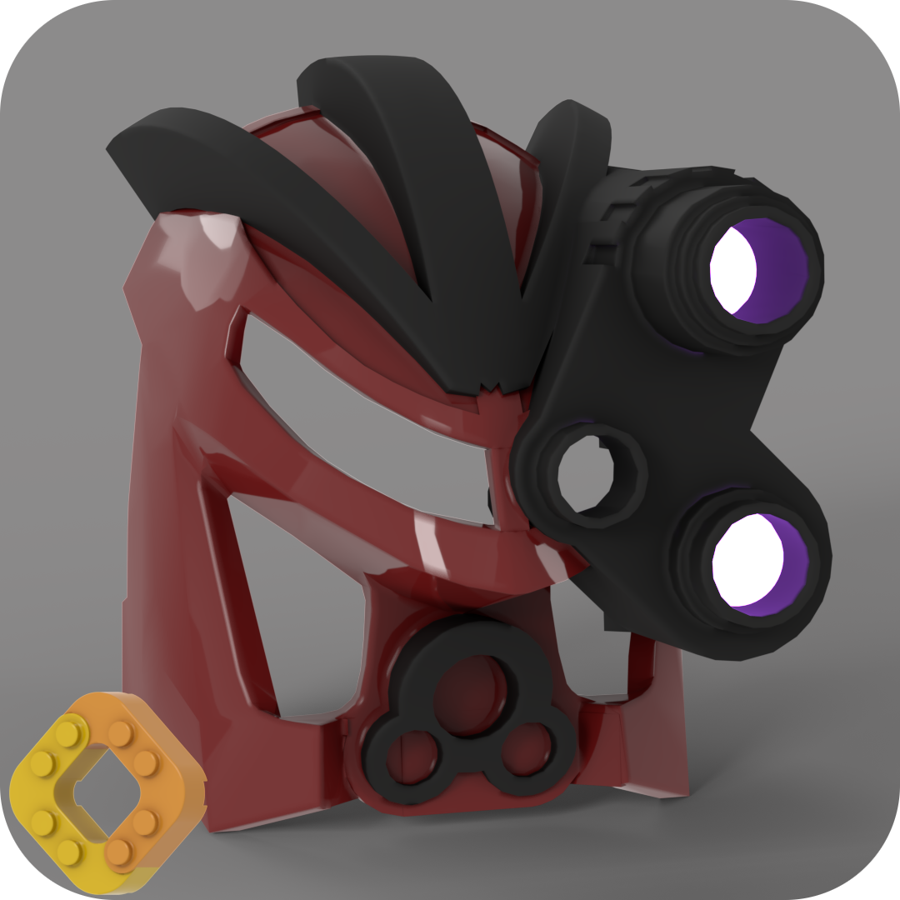

This is a graphical Python program for converting various 3D file formats(stl,3mf,obj,stp, etc.)
to the LDraw file format [(.dat)](http://www.ldraw.org/article/218). 
The converted files can be used with LDview, Bricklink Studio/Partdesigner and other compatible software.

The Graphical Userinterface:

After loading the source file the output file and part name are set to the same name(with .dat extension).

The default colour("16") will be used if not specified. 
You can check the official LDraw Colour Definition Reference for the available colour codes.
They can also be selected through the menu opened with the select button next to the custom colour field.
Only change the colour if you want to create a multicolour part or if you want to use a html colour("0x2hexcolour"), that is not available as a LDraw colour.
You can also select a html colour through the menu.

You can create multicolour parts by combining multiple dat files in one dat file.
You can use text a editor or another tool like Bricklink Partdesigner to combine mutiple dat files.

This version has no commandline interface, that was available in the previous versions.

Run/Install:

Currently there is only a Windows Version.
Under Releases you find an installer and a portable version.
If have an anti-virus software installed it might warn you, when running the installer.

Mac and Linux users have to setup a python environment with the dependencies found in "build-scripts/requirements.txt".

This was originally a fork of a [python script of Hazen Babcock](https://github.com/HazenBabcock/stl-to-dat).
The code that was used from that script was completely rewritten for the 1.0 release of this software.
This program was also renamed from "stlToDat" to "Convert To LDraw" to reflect the new capabilities of the new version.
