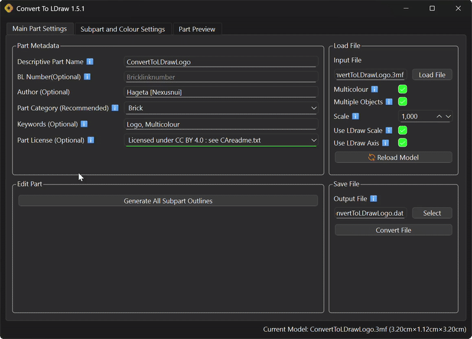

This is a graphical Python program for converting various 3D file formats(stl,3mf,obj,stp, etc.)
to the LDraw file format ([.dat](http://www.ldraw.org/article/218)).  
The converted files can be used with LDview, Bricklink Studio/Partdesigner and other compatible software.

The Graphical Userinterface:

After loading the source file the output file and part name are set to the same name(with .dat extension).  
If defined and found units will be converted to millimeters.
For best compatibility the units of the model should be in millimeters.  
The default colour("16") will be used if the model contains no colour data, otherwise direct colors are used. 
In the official [LDraw Colour Definition Reference](https://www.ldraw.org/article/547.html) you find all the available colour codes or check out the [SetDB Color Guide](https://www.merlinsbricks.com/colors/).
They can also be selected through the menu opened with the select button next to colour fields.
The main_colour("16") is the colour that can be changed by other editors like Bricklink Studio.
It is advised to use LDraw colours and not direct/html colours unless they are unavailable.
You can also select a html colour through the menu.

You can create multicolour parts by loading either a coloured/textured or multipart model.
Some notes about compatibility of multicolour/-part 3D file formats:
- multipart 3mf files are supported, while multicolour objects are not
- textures are converted to surface colours
- not all file formats and the features are fully tested

If a model has multiple objects, they are saved in a "s" folder, if you only want one file uncheck "Multiple Objects".

This version has no commandline interface, that was available in the previous versions.
# Run/Install:  
Currently there is only a installer for Windows Version(x86) and package installable through pipx/pip.  
Under Releases you find an installer and portable version for Windows and the package for pipx/pip.
If have an antivirus software installed it might warn you, when running the installer.  
To avoid the problems with an antivirus or for installation on Linux, Mac and possibly Windows on Arm(untested) follow the [manual installation guide](MANUALINSTALL.md),
which explains the installation with pipx.
# Supported filetypes:
- types that should work:
  - *.stl  *.3mf *.obj *.off *.ply *.gltf *.glb *.xaml *.stp *.step *.dae
- type that might work:
  - *.brep *.igs *.iges *.bdf *.msh *.inp *.diff *.mesh
- +more types if trimesh can load them  

Filetypes that get tested are: *.stl, *.3mf, *.obj and *.ply  
I cannot guaranty that all possible variations/features of these filetypes work.
# Known "Issues":  
- The preview may not show objects properly if they are larger the 20 meters(for what could you need a piece that big anyway?).
- On MacOS: Terminal window in the background, since pipx uses it to run a virtual environment
---
This was originally a fork of a [python script of Hazen Babcock](https://github.com/HazenBabcock/stl-to-dat).  
The code that was used from that script was completely rewritten for the 1.0 release of this software.  
This application was also renamed from "stlToDat" to "Convert To LDraw" to reflect the added capabilities of the new version.
The repository was unlinked as a fork of "stlToDat" for the release of version 1.3.0, as it is a standalone project. 

This uses a modified version of the [PyQt Color Picker](https://github.com/nlfmt/pyqt-colorpicker-widget) by nlfmt(Tom F).
